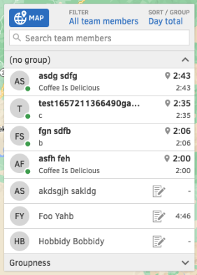
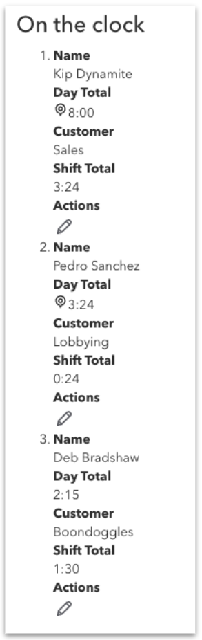
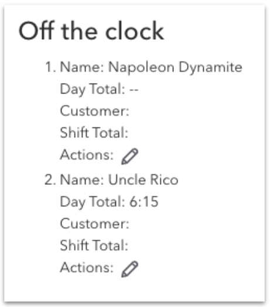
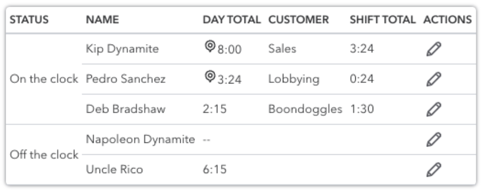
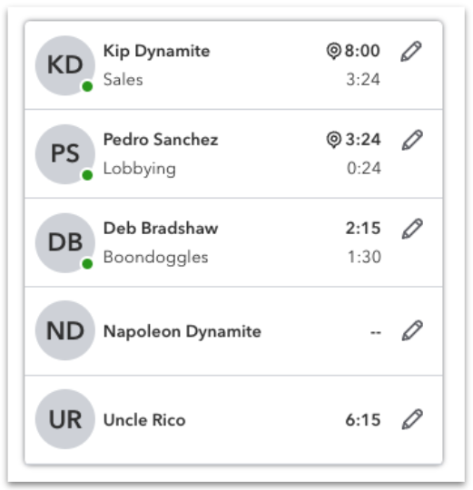
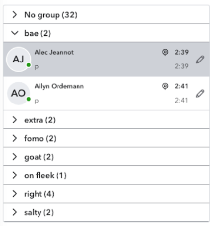
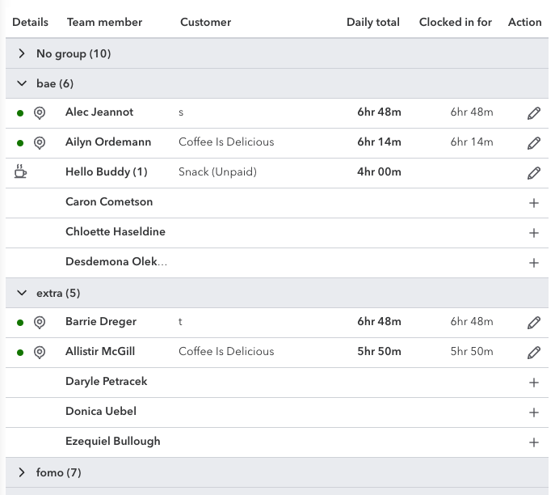

# Experiments

## Table vs List architecture
The purpose of this activity was to experiment and prove a new architecture for an old feature that was being updated. The old feature displayed a list of workers and metadata describing the worker's activities.

The problem with the existing functionality is that the list was not built for accessibility and did not meet HTML spec standards for a table or list layout. The layout does not provide any structure for a screen reader to announce, and the data presented visually does not include any context.

### Process

I used a recorded interview with a customer who is blind and uses a screen reader to watch how he uses the feature. He stated that this should be a table so the screen reader would be able to understand the structure and context of the data. Our accessibility leader felt that it should be a list.

My objective was to prove whether this "list" should be built as an HTML list or as an HTML table and then style it to match the new design. I did this by building the feature 3 different ways (description list, ordered list, and table), using strict, semantic HTML, and then applying CSS styles.

### Justification

The reason I used both description list and ordered list was to experience the screen reader and how it handles having separate property and value (description list) read aloud vs a string of text representing property and value read aloud at one time. The description list proved to be too noisy and verbose and required too many keyboard clicks to be helpful as compared to using a single string of text per item.

#### Videos
<ol>
    <li>
        <a href="https://drive.google.com/file/d/14qXV-1mY35f_3RBqDuY8rbHjw_FKeZj9/view?usp=sharing">Semantic description list (unstyled)</a>
        

            <!-- arrow-up-right-from-square icon by Free Icons (https://free-icons.github.io/free-icons/) -->
            <svg xmlns="http://www.w3.org/2000/svg" height="1em" fill="currentColor" viewBox="0 0 512 512">
                <path d="M 304 24 Q 306 46 328 48 L 430 48 L 430 48 L 207 271 L 207 271 Q 193 288 207 305 Q 224 319 241 305 L 464 82 L 464 82 L 464 184 L 464 184 Q 466 206 488 208 Q 510 206 512 184 L 512 24 L 512 24 Q 510 2 488 0 L 328 0 L 328 0 Q 306 2 304 24 L 304 24 Z M 72 32 Q 41 33 21 53 L 21 53 L 21 53 Q 1 73 0 104 L 0 440 L 0 440 Q 1 471 21 491 Q 41 511 72 512 L 408 512 L 408 512 Q 439 511 459 491 Q 479 471 480 440 L 480 312 L 480 312 Q 478 290 456 288 Q 434 290 432 312 L 432 440 L 432 440 Q 430 462 408 464 L 72 464 L 72 464 Q 50 462 48 440 L 48 104 L 48 104 Q 50 82 72 80 L 200 80 L 200 80 Q 222 78 224 56 Q 222 34 200 32 L 72 32 L 72 32 Z" />
            </svg>
        

    </li>
    <li>
        <a href="https://drive.google.com/file/d/1DKvfOHJ8Oexj1W0kCi5EgQFlZ_2Hz035/view?usp=sharing">Semantic ordered list (unstyled)</a>
        

            <!-- arrow-up-right-from-square icon by Free Icons (https://free-icons.github.io/free-icons/) -->
            <svg xmlns="http://www.w3.org/2000/svg" height="1em" fill="currentColor" viewBox="0 0 512 512">
                <path d="M 304 24 Q 306 46 328 48 L 430 48 L 430 48 L 207 271 L 207 271 Q 193 288 207 305 Q 224 319 241 305 L 464 82 L 464 82 L 464 184 L 464 184 Q 466 206 488 208 Q 510 206 512 184 L 512 24 L 512 24 Q 510 2 488 0 L 328 0 L 328 0 Q 306 2 304 24 L 304 24 Z M 72 32 Q 41 33 21 53 L 21 53 L 21 53 Q 1 73 0 104 L 0 440 L 0 440 Q 1 471 21 491 Q 41 511 72 512 L 408 512 L 408 512 Q 439 511 459 491 Q 479 471 480 440 L 480 312 L 480 312 Q 478 290 456 288 Q 434 290 432 312 L 432 440 L 432 440 Q 430 462 408 464 L 72 464 L 72 464 Q 50 462 48 440 L 48 104 L 48 104 Q 50 82 72 80 L 200 80 L 200 80 Q 222 78 224 56 Q 222 34 200 32 L 72 32 L 72 32 Z" />
            </svg>
        

    </li>
    <li>
        <a href="https://drive.google.com/file/d/1sWE4BQ752GY3LWBaN19Ym0NjyyqXE5Ym/view?usp=sharing">Semantic Table (unstyled)</a>
        

            <!-- arrow-up-right-from-square icon by Free Icons (https://free-icons.github.io/free-icons/) -->
            <svg xmlns="http://www.w3.org/2000/svg" height="1em" fill="currentColor" viewBox="0 0 512 512">
                <path d="M 304 24 Q 306 46 328 48 L 430 48 L 430 48 L 207 271 L 207 271 Q 193 288 207 305 Q 224 319 241 305 L 464 82 L 464 82 L 464 184 L 464 184 Q 466 206 488 208 Q 510 206 512 184 L 512 24 L 512 24 Q 510 2 488 0 L 328 0 L 328 0 Q 306 2 304 24 L 304 24 Z M 72 32 Q 41 33 21 53 L 21 53 L 21 53 Q 1 73 0 104 L 0 440 L 0 440 Q 1 471 21 491 Q 41 511 72 512 L 408 512 L 408 512 Q 439 511 459 491 Q 479 471 480 440 L 480 312 L 480 312 Q 478 290 456 288 Q 434 290 432 312 L 432 440 L 432 440 Q 430 462 408 464 L 72 464 L 72 464 Q 50 462 48 440 L 48 104 L 48 104 Q 50 82 72 80 L 200 80 L 200 80 Q 222 78 224 56 Q 222 34 200 32 L 72 32 L 72 32 Z" />
            </svg>
        

    </li>
    <li>
        <a href="https://drive.google.com/file/d/1C0A5lnI6yVoTdY-TwUvW-YPLyi16QsO4/view?usp=sharing">Final Table (styled)</a>
        

            <!-- arrow-up-right-from-square icon by Free Icons (https://free-icons.github.io/free-icons/) -->
            <svg xmlns="http://www.w3.org/2000/svg" height="1em" fill="currentColor" viewBox="0 0 512 512">
                <path d="M 304 24 Q 306 46 328 48 L 430 48 L 430 48 L 207 271 L 207 271 Q 193 288 207 305 Q 224 319 241 305 L 464 82 L 464 82 L 464 184 L 464 184 Q 466 206 488 208 Q 510 206 512 184 L 512 24 L 512 24 Q 510 2 488 0 L 328 0 L 328 0 Q 306 2 304 24 L 304 24 Z M 72 32 Q 41 33 21 53 L 21 53 L 21 53 Q 1 73 0 104 L 0 440 L 0 440 Q 1 471 21 491 Q 41 511 72 512 L 408 512 L 408 512 Q 439 511 459 491 Q 479 471 480 440 L 480 312 L 480 312 Q 478 290 456 288 Q 434 290 432 312 L 432 440 L 432 440 Q 430 462 408 464 L 72 464 L 72 464 Q 50 462 48 440 L 48 104 L 48 104 Q 50 82 72 80 L 200 80 L 200 80 Q 222 78 224 56 Q 222 34 200 32 L 72 32 L 72 32 Z" />
            </svg>
        

    </li>
</ol>

### Examples

    

        <h3>Description List</h3>
        
    

    

        <h3>Ordered List</h3>
        
    

    

        <h3>Semantic Table</h3>
        
    

    

        <h3>Styled Table</h3>
        
    

### Result
The result of this experiment was to build the feature following the table spec, using CSS grid to modify the visual alignment of the cells to look like the list.

    <h4>Semantic Table</h4>
    

    <h4>Styled Table</h4>
    

    <h4>Final with expand/collapse rows</h4>
    

### Lessons learned
1. Visually delightful does not mean accessible
    > The original design, though delightful, did not account for or describe an accessible experience and was not usable for someone using a screen reader
2. Accessible does not mean delightful experience
    > Using the description list nor the ordered list, though completely accessible, did not provide a delightful experience for someone using a screen reader
3. Building to spec does not mean it is a delightful experience
    > Simply building to spec without considering the layout and style does not mean the experience will be delightful
4. CSS Flexbox negatively affected the screen reader behavior using the table, which dictated the architecture of the table
    > Switching to CSS Grid removed this issue and maintained the expected style

### Further enhancements

A future redesign changed the visual layout of the feature, remove the card list style and replacing it with a table style. The architecture was already a table, so all that was needed was to re-style the CSS and modify a few columns.

    <h4>Table Redesign</h4>
    

