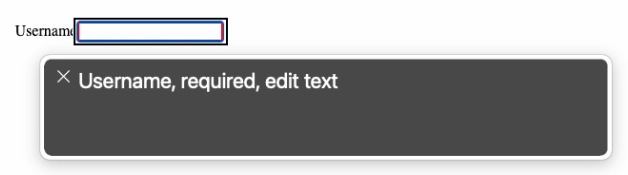

# Easy input validation with HTML and React

It's no surprise that HTML form validation can quickly become overly complicated to manage. During a recent code challenge that I was working through, I discovered a simple way to do `input` field validation using minimal JSX/React and documented `input` attributes and CSS.

This approach takes advantage of native HTML controls and attributes, CSS psuedo-classes and psuedo-elements, and minimal React code. This results in a solution that is easy to manage as more `input`s are added and provides an accessible experience to keyboards and screen readers.

## Basic Setup

This guide assumes that you already know how to build a simple `<input />` as a stateful component with React's `useState` hook and the `input`'s `value` and `onChange` attributes. For further information you can read React's [input API reference](https://react.dev/reference/react-dom/components/input). Let's take a quick look at our basic setup.

We are going to use minimal CSS styling throughout so that we can focus just on the structure and functionality. At the end of this guide there is a fully functional and styled example for reference.

### HTML

Not much to see here, and we won't be using it anymore beyond this `#root` element.
```html
<div id="root"></div>
```

### CSS

This will give us some simple alignment of the `#root` container to get our examples into the center of the viewport.

```css
#root {
  width: 100vw;
  height: 100vh;
  display: flex;
  justify-content: center;
  align-items: center;
}
```

### JSX

Creates a simple `label` and `input` for entering a string of text to be used as someone's username.

```javascript
import React, { useState } from "https://esm.sh/react";
import ReactDOM from "https://esm.sh/react-dom";


function RootContainer() {
  const [username, setUsername] = useState('');
 
  function handleUsernameChange(e) {
    setUsername(e.target.value);
  }

  return (
    <div>
      <label for="signup-username">Username</label>
      <input id="signup-username" type="text" value={username} onChange={handleUsernameChange} required />
    </div>
  );
}


const root = ReactDOM.createRoot(document.getElementById('root'));
root.render(
  <React.StrictMode>
    <RootContainer />
  </React.StrictMode>
);
```

### Result

<p class="codepen" data-height="300" data-default-tab="js,result" data-slug-hash="xxorWBx" data-pen-title="Easy input validation 1" data-user="Josh-Harrison" style="height: 300px; box-sizing: border-box; display: flex; align-items: center; justify-content: center; border: 2px solid; margin: 1em 0; padding: 1em;">
  <span>See the Pen <a href="https://codepen.io/Josh-Harrison/pen/xxorWBx">
  Easy input validation 1</a> by Josh Harrison (<a href="https://codepen.io/Josh-Harrison">@Josh-Harrison</a>)
  on <a href="https://codepen.io">CodePen</a>.</span>
</p>
<script async src="https://cpwebassets.codepen.io/assets/embed/ei.js"></script>

## Add a validation pattern

We are going to use the `input`'s [`pattern` attribute](https://developer.mozilla.org/en-US/docs/Web/HTML/Attributes/pattern) to specify a regular expression that the value should match. For our example, we will require that the username contains 8 to 10 alphanumeric characters and no special characters. We'll also add a simple style to the `input`'s `:valid` and `:invalid` pseudo-classes to illustrate the two states.

> NOTE: These pseudo-classes use red and green to convey invalid and valid. To meet accessibility guidelines it is never recommended to [convey meaning by color alone](https://www.w3.org/WAI/WCAG21/Understanding/use-of-color). We will improve these styles as we continue.

### JSX

```javascript
// ...

// Add the pattern attribute and value to the input element
return (
    <div>
      <label for="signup-username">Username</label>
      <input 
        id="signup-username"
        type="text"
        value={username}
        onChange={handleUsernameChange}
        required
        pattern="\w{8,10}"
      />
    </div>
  );

// ...
```

### CSS

```css
/* Add two pseudo-classes to your CSS */
#signup-username:invalid {
  border: 3px solid red;
}

#signup-username:valid {
  border: 3px solid green;
}
```

### Result

<p class="codepen" data-height="300" data-default-tab="js,result" data-slug-hash="poXwVaM" data-pen-title="Easy input validation 2" data-user="Josh-Harrison" style="height: 300px; box-sizing: border-box; display: flex; align-items: center; justify-content: center; border: 2px solid; margin: 1em 0; padding: 1em;">
  <span>See the Pen <a href="https://codepen.io/Josh-Harrison/pen/poXwVaM">
  Easy input validation 2</a> by Josh Harrison (<a href="https://codepen.io/Josh-Harrison">@Josh-Harrison</a>)
  on <a href="https://codepen.io">CodePen</a>.</span>
</p>
<script async src="https://cpwebassets.codepen.io/assets/embed/ei.js"></script>
    
## Add helper text

Now we will add helper text to the `input` to describe the expected format. We need to make sure that the helper text is accessible to support a screen reader. The [`pattern` spec](https://developer.mozilla.org/en-US/docs/Web/HTML/Attributes/pattern#usability_and_accessibility_considerations) suggests using a `title` attribute. The [`title` attribute](https://developer.mozilla.org/en-US/docs/Web/HTML/Element/input#title) is represented as a tooltip and is announced as secondary or supplemental information by a screen reader.

### JSX

```javascript
// ...

// Add the title attribute and value to the input element
return (
    <div>
      <label for="signup-username">Username</label>
      <input 
        id="signup-username"
        type="text"
        value={username}
        onChange={handleUsernameChange}
        required
        pattern="\w{8,10}"
        title="8 to 10 characters, should not contain any spaces or special characters"
      />
    </div>
  );

// ...
```

### Result

* Mouse Hover
    <div class="media-image-container"></div>
* Screen Reader
    <div class="media-image-container"></div>
    <div class="media-image-container"></div>

<p class="codepen" data-height="300" data-default-tab="js,result" data-slug-hash="bGPRjZL" data-pen-title="Easy input validation 3" data-user="Josh-Harrison" style="height: 300px; box-sizing: border-box; display: flex; align-items: center; justify-content: center; border: 2px solid; margin: 1em 0; padding: 1em;">
  <span>See the Pen <a href="https://codepen.io/Josh-Harrison/pen/bGPRjZL">
  Easy input validation 3</a> by Josh Harrison (<a href="https://codepen.io/Josh-Harrison">@Josh-Harrison</a>)
  on <a href="https://codepen.io">CodePen</a>.</span>
</p>
<script async src="https://cpwebassets.codepen.io/assets/embed/ei.js"></script>

An alternative to using a `title` tooltip is to add visible text that describes the `input` using `aria-describedby`. The [`aria-describedby` attribute](https://developer.mozilla.org/en-US/docs/Web/Accessibility/ARIA/Attributes/aria-describedby) expects an HTML `id` of the text that describes it. For our example, we will add helper text with a unique `id` as a sibling to the `input` and point the `input` to the helper text using `aria-describedby`. Using this method puts visible text on the page that is still announced by a screen reader as secondary or supplemental text when the screen reader focuses on the `input`.

### JSX

```javascript
// ...

// Add the aria-describedby attribute and the helper text sibling
return (
    <div>
      <label for="signup-username">Username</label>
      <input 
        id="signup-username"
        type="text"
        value={username}
        onChange={handleUsernameChange}
        required
        pattern="\w{8,10}"
        aria-describedby="signup-username-helper-text"
      />
      <div id="signup-username-helper-text">
        8 to 10 characters, should not contain any spaces or special characters
      </div>
    </div>
  );

// ...
```

### Result

* Screen Reader
    <div class="media-image-container"></div>

<p class="codepen" data-height="300" data-default-tab="js,result" data-slug-hash="rNEwZxX" data-pen-title="Easy input validation 4" data-user="Josh-Harrison" style="height: 300px; box-sizing: border-box; display: flex; align-items: center; justify-content: center; border: 2px solid; margin: 1em 0; padding: 1em;">
  <span>See the Pen <a href="https://codepen.io/Josh-Harrison/pen/rNEwZxX">
  Easy input validation 4</a> by Josh Harrison (<a href="https://codepen.io/Josh-Harrison">@Josh-Harrison</a>)
  on <a href="https://codepen.io">CodePen</a>.</span>
</p>
<script async src="https://cpwebassets.codepen.io/assets/embed/ei.js"></script>

## Validation status icon

Now that we have validation and helper text, let's add a visual cue indicating whether the field is valid or not. For this example we will use a heavy exclamation point (&#10071;) and a heavy check mark (&#10004;) to indicate invalid and valid, respectively. We can easily add a `div` as a direct sibling to the `input` in our JSX and then use a CSS psuedo-class to show either the checkmark or the exclamation point psuedo-element.

### JSX

```javascript
// ...

// Add the div.validation-status directly after the input
return (
    <div>
      <label for="signup-username">Username</label>
      <input 
        id="signup-username"
        type="text"
        value={username}
        onChange={handleUsernameChange}
        required
        pattern="\w{8,10}"
        aria-describedby="signup-username-helper-text"
      />
      <div className="validation-status"></div>
      <div id="signup-username-helper-text">
        8 to 10 characters, should not contain any spaces or special characters
      </div>
    </div>
  );

// ...
```

### CSS

```css
/* Modify the two psuedo-classes to use the direct sibling's psuedo-element */
#signup-username:invalid + .validation-status:after {
  content: "\2757";
}

#signup-username:valid + .validation-status:after {
  content: "\2714";
}
```

### Result

<p class="codepen" data-height="300" data-default-tab="js,result" data-slug-hash="XWLzbRX" data-pen-title="Easy  input validation 5" data-user="Josh-Harrison" style="height: 300px; box-sizing: border-box; display: flex; align-items: center; justify-content: center; border: 2px solid; margin: 1em 0; padding: 1em;">
  <span>See the Pen <a href="https://codepen.io/Josh-Harrison/pen/XWLzbRX">
  Easy  input validation 5</a> by Josh Harrison (<a href="https://codepen.io/Josh-Harrison">@Josh-Harrison</a>)
  on <a href="https://codepen.io">CodePen</a>.</span>
</p>
<script async src="https://cpwebassets.codepen.io/assets/embed/ei.js"></script>

## Check validation on an action

With all of the foundational elements, attributes, and styles in place, we can add a button that will check for any invalid fields when it is clicked. This way we can simulate blocking the data submit if the field or any number of fields are invalid.

In order to check the validity of the `input` field, we have to attach a `ref` to it to keep track of it. The `ref` will allow us to use the `checkValidity()` helper to summarize the validity state as either `true` or `false`. There are a good number of specific validity checks you can do by using the [`input`'s `ValidityState API`](https://developer.mozilla.org/en-US/docs/Web/HTML/Element/input#client-side_validation), but for our example we will use the overall `boolean` check.

### JSX

```javascript
// Add the useRef hook to your imports
import React, { useRef, useState } from "https://esm.sh/react";

// ...

const [username, setUsername] = useState('');
// Add a ref to the username input
const usernameRef = useRef(null);

// ...

// Add a click handler for the submit button
function handleSubmitClick() {
  // Check the validity status of the input field
  const isValid = usernameRef.current.checkValidity();
  if (isValid) {
    alert("Success!");
  } else {
    alert("Please try again.");
  }
}

// ...

// Add a Submit button with an onClick
<div className="validation-status"></div>
<div id="signup-username-helper-text">
  8 to 10 characters, should not contain any spaces or special characters
</div>
<button onClick={handleSubmitClick}>Submit</button>

// ...
```

### Result

<p class="codepen" data-height="300" data-default-tab="js,result" data-slug-hash="KKjypRP" data-pen-title="Easy input validation 6" data-user="Josh-Harrison" style="height: 300px; box-sizing: border-box; display: flex; align-items: center; justify-content: center; border: 2px solid; margin: 1em 0; padding: 1em;">
  <span>See the Pen <a href="https://codepen.io/Josh-Harrison/pen/KKjypRP">
  Easy input validation 6</a> by Josh Harrison (<a href="https://codepen.io/Josh-Harrison">@Josh-Harrison</a>)
  on <a href="https://codepen.io">CodePen</a>.</span>
</p>
<script async src="https://cpwebassets.codepen.io/assets/embed/ei.js"></script>

## Wrap-up

That's it, you have an easy way to do `input` validation.
If you wanted to add more fields to your form you could still easily validate them by
1. Assigning individual `ref`'s to each `input`
2. Modify the `handleSubmitClick` handler to loop through each of the `input` `ref`s and `checkValidity` to set an overall `isValid` value

There are other [`input` `type`s](https://developer.mozilla.org/en-US/docs/Web/HTML/Element/input#input_types) that you can use in your form and configuring validation on them is the same as described in this guide. For instance, you could have `<input type="email" />` and use `pattern=".+@\w+.com"` to ensure a valid `email@example.com` format is expected. Likewise, you could have `<input type="password">` that expects 8 characters with 1 or more special characters and use `pattern="[\w+!@$&%]{8}"`.

Here is an example of a sign up form that uses all three.

<p class="codepen" data-height="700" data-default-tab="js,result" data-slug-hash="oNrwNax" data-pen-title="Sign Up form with easy input validation" data-user="Josh-Harrison" style="height: 300px; box-sizing: border-box; display: flex; align-items: center; justify-content: center; border: 2px solid; margin: 1em 0; padding: 1em;">
  <span>See the Pen <a href="https://codepen.io/Josh-Harrison/pen/oNrwNax">
  Sign Up form with easy input validation</a> by Josh Harrison (<a href="https://codepen.io/Josh-Harrison">@Josh-Harrison</a>)
  on <a href="https://codepen.io">CodePen</a>.</span>
</p>
<script async src="https://cpwebassets.codepen.io/assets/embed/ei.js"></script>
