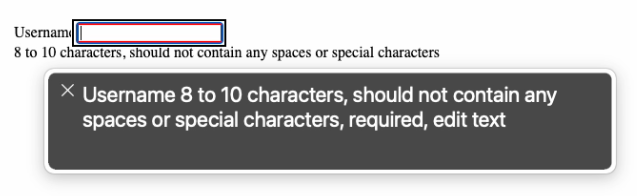

# Easy input validation with HTML and React

describe how form validation can get unwieldy

TL;DR of the solution
uses the `input`'s [`pattern`](https://developer.mozilla.org/en-US/docs/Web/HTML/Element/input#pattern) attribute
uses the `:valid` and `:invalid` CSS pseudo-classes to display error messages
uses the `input`'s `checkValidity` to check the validity (test with `reportValidity`) too
uses the `input`'s `setCustomValidity` to display a custom message

Benefits
    accessibility
    native HTML attributes
    code management

Implementation
## Basic Setup
This guide assumes that you already know how to build a simple `<input />` as a stateful component with React's `useState` hook and the `input`'s `value` and `onChange` attributes. For further information you can read React's [input API reference](https://react.dev/reference/react-dom/components/input). Let's take a quick look at our basic setup.

We are going to use minimal CSS styling throughout so that we can focus just on the HTML structure and React functionality. At the end of this guide, I'll include some quick styling that will make it more visually appealing.

### HTML
Not much to see here, and we won't be using it anymore beyond this `#root` element.
```html
<div id="root"></div>
```

### CSS
Simple alignment of the `#root` container to get our examples into the center of the viewport.
```css
#root {
  width: 100vw;
  height: 100vh;
  display: flex;
  justify-content: center;
  align-items: center;
}
```

### JS
Creates a simple `label` and `input` for entering a string of text to be used as someone's username.
```javascript
import React, { useState } from "https://esm.sh/react";
import ReactDOM from "https://esm.sh/react-dom";


function RootContainer() {
  const [username, setUsername] = useState('');
 
  function handleUsernameChange(e) {
    setUsername(e.target.value);
  }

  return (
    <div>
      <label for="signup-username">Username</label>
      <input id="signup-username" type="text" value={username} onChange={handleUsernameChange} required />
    </div>
  );
}


const root = ReactDOM.createRoot(document.getElementById('root'));
root.render(
  <React.StrictMode>
    <RootContainer />
  </React.StrictMode>
);
```

### Result
<p class="codepen" data-height="300" data-default-tab="js,result" data-slug-hash="xxorWBx" data-pen-title="Easy input validation 1" data-user="Josh-Harrison" style="height: 300px; box-sizing: border-box; display: flex; align-items: center; justify-content: center; border: 2px solid; margin: 1em 0; padding: 1em;">
  <span>See the Pen <a href="https://codepen.io/Josh-Harrison/pen/xxorWBx">
  Easy input validation 1</a> by Josh Harrison (<a href="https://codepen.io/Josh-Harrison">@Josh-Harrison</a>)
  on <a href="https://codepen.io">CodePen</a>.</span>
</p>
<script async src="https://cpwebassets.codepen.io/assets/embed/ei.js"></script>

## Add a validation pattern
We are going to use the `input`'s [`pattern` attribute](https://developer.mozilla.org/en-US/docs/Web/HTML/Attributes/pattern) to specify a regular expression that the value should match. For our example, we will require that the username contains 8 to 10 alphanumeric characters and no special characters. We'll also add a simple style to the `input`'s `:valid` and `:invalid` pseudo-classes to illustrate the two states.

> NOTE: These pseudo-classes use red and green to convey invalid and valid. To meet accessibility guidelines it is never recommended to convey meaning by color alone. We will improve these styles as we continue.

```javascript
// ...

// Add the pattern attribute and value to the input element
return (
    <div>
      <label for="signup-username">Username</label>
      <input 
        id="signup-username"
        type="text"
        value={username}
        onChange={handleUsernameChange}
        required
        pattern="\w{8,10}"
      />
    </div>
  );

// ...
```
```css
/* Add two pseudo-classes to your CSS */
#signup-username:invalid {
  border: 3px solid red;
}

#signup-username:valid {
  border: 3px solid green;
}
```

<p class="codepen" data-height="300" data-default-tab="js,result" data-slug-hash="poXwVaM" data-pen-title="Easy input validation 2" data-user="Josh-Harrison" style="height: 300px; box-sizing: border-box; display: flex; align-items: center; justify-content: center; border: 2px solid; margin: 1em 0; padding: 1em;">
  <span>See the Pen <a href="https://codepen.io/Josh-Harrison/pen/poXwVaM">
  Easy input validation 2</a> by Josh Harrison (<a href="https://codepen.io/Josh-Harrison">@Josh-Harrison</a>)
  on <a href="https://codepen.io">CodePen</a>.</span>
</p>
<script async src="https://cpwebassets.codepen.io/assets/embed/ei.js"></script>
    
## Add helper text

Now we will add helper text to the `input` to describe the expected format. We need to make sure that the helper text is accessible to support a screen reader. The [`pattern` spec](https://developer.mozilla.org/en-US/docs/Web/HTML/Attributes/pattern#usability_and_accessibility_considerations) suggests using a `title` attribute. The [`title` attribute](https://developer.mozilla.org/en-US/docs/Web/HTML/Element/input#title) is represented as a tooltip and is announced as secondary or supplemental information by a screen reader.

```javascript
// ...

// Add the title attribute and value to the input element
return (
    <div>
      <label for="signup-username">Username</label>
      <input 
        id="signup-username"
        type="text"
        value={username}
        onChange={handleUsernameChange}
        required
        pattern="\w{8,10}"
        title="8 to 10 characters, should not contain any spaces or special characters"
      />
    </div>
  );

// ...
```
* Mouse Hover
    <div class="media-image-container"></div>
* Screen Reader
    <div class="media-image-container"></div>
    <div class="media-image-container"></div>

<p class="codepen" data-height="300" data-default-tab="js,result" data-slug-hash="bGPRjZL" data-pen-title="Easy input validation 3" data-user="Josh-Harrison" style="height: 300px; box-sizing: border-box; display: flex; align-items: center; justify-content: center; border: 2px solid; margin: 1em 0; padding: 1em;">
  <span>See the Pen <a href="https://codepen.io/Josh-Harrison/pen/bGPRjZL">
  Easy input validation 3</a> by Josh Harrison (<a href="https://codepen.io/Josh-Harrison">@Josh-Harrison</a>)
  on <a href="https://codepen.io">CodePen</a>.</span>
</p>
<script async src="https://cpwebassets.codepen.io/assets/embed/ei.js"></script>

An alternative to using a `title` tooltip is to add visible text that describes the `input` using `aria-describedby`. The [`aria-describedby` attribute](https://developer.mozilla.org/en-US/docs/Web/Accessibility/ARIA/Attributes/aria-describedby) expects an HTML `id` of the text that describes it. For our example, we will add helper text with a unique `id` as a sibling to the `input` and point the `input` to the helper text using `aria-describedby`. Using this method puts visible text on the page that is announced by a screen reader still as secondary or supplemental text when the screen reader focuses on the `input`.

```javascript
// ...

// Add the aria-describedby attribute and the helper text sibling
return (
    <div>
      <label for="signup-username">Username</label>
      <input 
        id="signup-username"
        type="text"
        value={username}
        onChange={handleUsernameChange}
        required
        pattern="\w{8,10}"
        aria-describedby="signup-username-helper-text"
      />
      <div id="signup-username-helper-text">
        8 to 10 characters, should not contain any spaces or special characters
      </div>
    </div>
  );

// ...
```

* Screen Reader
    <div class="media-image-container"></div>

<p class="codepen" data-height="300" data-default-tab="js,result" data-slug-hash="rNEwZxX" data-pen-title="Easy input validation 4" data-user="Josh-Harrison" style="height: 300px; box-sizing: border-box; display: flex; align-items: center; justify-content: center; border: 2px solid; margin: 1em 0; padding: 1em;">
  <span>See the Pen <a href="https://codepen.io/Josh-Harrison/pen/rNEwZxX">
  Easy input validation 4</a> by Josh Harrison (<a href="https://codepen.io/Josh-Harrison">@Josh-Harrison</a>)
  on <a href="https://codepen.io">CodePen</a>.</span>
</p>
<script async src="https://cpwebassets.codepen.io/assets/embed/ei.js"></script>

## Validation status icon

Now that we have validation and helper text, let's add a visual cue indicating whether the field is valid or not. For this example we will use a heavy exclamation point (&#10071;) and a heavy check mark (&#10004;) to indicate invalid and valid, respectively. We can easily add a `div` as a direct sibling to the `input` in our JSX and then use a CSS psuedo-class to show either the checkmark or the exclamation point psuedo-element.

```javascript
// ...

// Add the div.validation-status directly after the input
return (
    <div>
      <label for="signup-username">Username</label>
      <input 
        id="signup-username"
        type="text"
        value={username}
        onChange={handleUsernameChange}
        required
        pattern="\w{8,10}"
        aria-describedby="signup-username-helper-text"
      />
      <div className="validation-status"></div>
      <div id="signup-username-helper-text">
        8 to 10 characters, should not contain any spaces or special characters
      </div>
    </div>
  );

// ...
```

```css
/* Modify the two psuedo-classes to use the direct sibling's psuedo-element */
#signup-username:invalid + .validation-status:after {
  content: "\2757";
}

#signup-username:valid + .validation-status:after {
  content: "\2714";
}
```
<p class="codepen" data-height="300" data-default-tab="js,result" data-slug-hash="XWLzbRX" data-pen-title="Easy  input validation 5" data-user="Josh-Harrison" style="height: 300px; box-sizing: border-box; display: flex; align-items: center; justify-content: center; border: 2px solid; margin: 1em 0; padding: 1em;">
  <span>See the Pen <a href="https://codepen.io/Josh-Harrison/pen/XWLzbRX">
  Easy  input validation 5</a> by Josh Harrison (<a href="https://codepen.io/Josh-Harrison">@Josh-Harrison</a>)
  on <a href="https://codepen.io">CodePen</a>.</span>
</p>
<script async src="https://cpwebassets.codepen.io/assets/embed/ei.js"></script>

## Check validation on an action

With all of the foundational elements, attributes, and styles in place, we can add a button that will check for any invalid field statuses when it is clicked. This way we can simulate blocking the data submit if the field or any number of fields are invalid.

```javascript

```


  this setup assumes you already know how to connect an input to react state management
    input and attributes
        start with type=text for simplicity
        pattern
        validity
            verify whether validity is always there or only if pattern is used
    react setup for input (leave details out)
    include a ref (link)
    show validity and valid state
    screen reader output
Other input types
    password
    email
    link to other types

OUttro
    link to codepen for final example this is based off of

